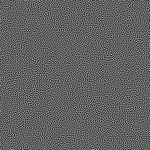

# void-n-cluster

## References

- https://blog.demofox.org/2019/06/25/generating-blue-noise-textures-with-void-and-cluster/
- https://github.com/Atrix256/VoidAndCluster
- http://cv.ulichney.com/papers/1993-void-cluster.pdf